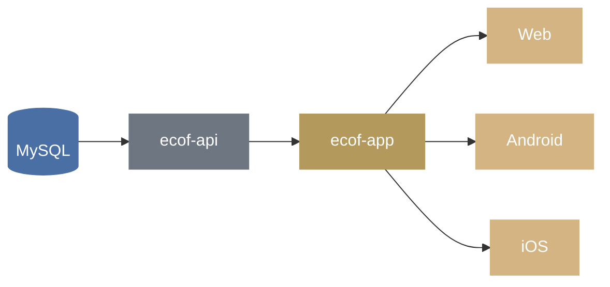

<p align="center">
  
</p>

<p align="center">
  Official mobile application of the <em>Eglise Catholique Orthodoxe de France</em>.
</p>

<p align="center">
  
  
  
  
  
</p>

---

## About

ECOF app is built to help the faithful and visitors of the _Eglise Catholique Orthodoxe de France_, stay connected with parish life. It brings together a parish directory and map, a liturgical calendar, and other community features in a single cross-platform app.

The app is built with **Ionic Vue** and **Capacitor**, and ships as a web app as well as native Android and iOS builds. It consumes the [ecof-api](https://github.com/jrc0de/ecof-api) backend for parish data and liturgical calendar feeds.

## Architecture



## Features

- 📍 **Parish directory & map** — find parishes near you, powered by [MapLibre GL](https://maplibre.org/) and offline-friendly [Protomaps](https://protomaps.com/) vector tiles
- ☦ **Offices**
- 📅 **Liturgical calendar**
- 📱 **Cross-platform** — single codebase for web, Android, and iOS via Capacitor

## Tech Stack

| Layer                | Technology                                                                                          |
| -------------------- | --------------------------------------------------------------------------------------------------- |
| Framework            | [Vue 3](https://vuejs.org/) + [Ionic Vue](https://ionicframework.com/docs/vue/overview)             |
| Native runtime       | [Capacitor](https://capacitorjs.com/) (Android & iOS)                                               |
| Mapping              | [MapLibre GL](https://maplibre.org/) + [Protomaps](https://docs.protomaps.com/)                     |
| Linting / formatting | [oxlint](https://oxc.rs/docs/guide/usage/linter.html) + [oxfmt](https://oxc.rs/)                    |
| Backend              | [ecof-api](https://github.com/jrc0de/ecof-api) ([Hono](https://hono.dev/) + [Bun](https://bun.sh/)) |
| Database             | MySQL                                                                                               |

## Getting Started

### Prerequisites

- [Node.js](https://nodejs.org/) (LTS recommended) with npm, **or** [Bun](https://bun.sh/) as an alternative runtime/package manager
- For native builds: [Android Studio](https://developer.android.com/studio) and [Xcode](https://developer.apple.com/xcode/)

### Installation

```bash
git clone https://github.com/jrc0de/ecof-app.git
cd ecof-app
npm install
```

> Using Bun instead? Run `bun install` and replace `npm run <script>` with `bun run <script>` in the commands below.

### Development

Run the app in the browser with hot reload:

```bash
npm run dev
```

### Build

```bash
npm run build
```

### Preview the production build

```bash
npm run preview
```

## Mobile (Capacitor)

After building the web assets, sync them to the native projects:

```bash
npm run build
npx cap sync
```

Then open the native project in the respective IDE:

```bash
npx cap open android
npx cap open ios
```

App icons and splash screens are managed via [`@capacitor/assets`](https://github.com/ionic-team/capacitor-assets).

## Linting & Formatting

```bash
npm run lint        # check for lint issues
npm run lint:fix     # auto-fix lint issues
npm run fmt          # format code
npm run fmt:check    # check formatting without writing
```

## Related Projects

- [ecof-api](https://github.com/jrc0de/ecof-api) — backend API (Hono) providing parishes calendars (iCal), liturgical calendar, and other content...

## License

This project is licensed under the [MIT License](../LICENSE).
